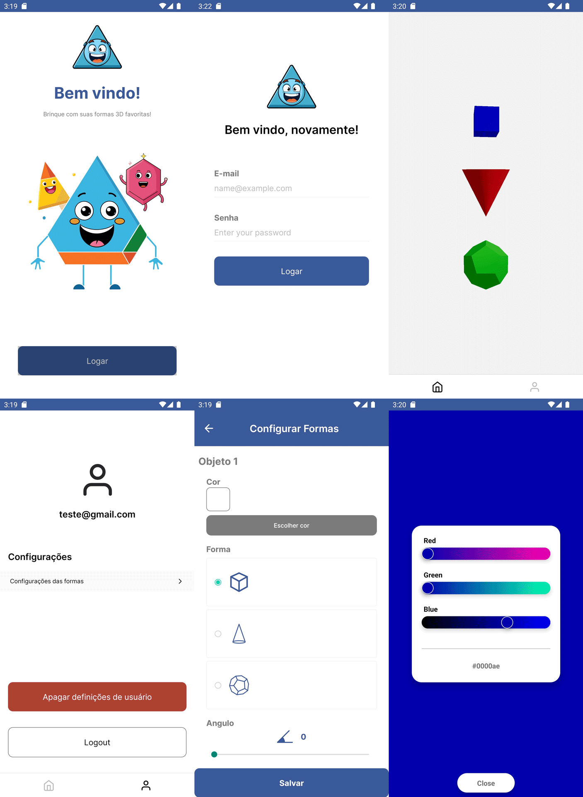
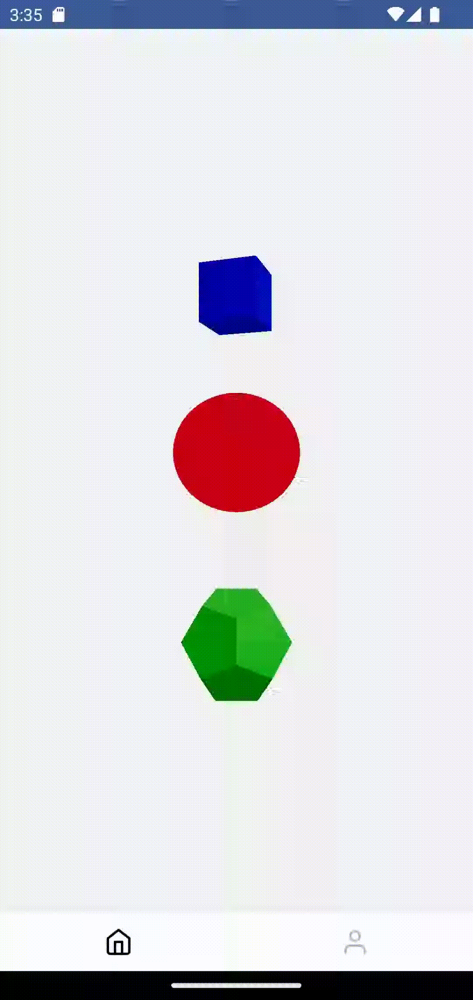

## Desafio Front End Mobile HandTalks

O desafio tem como objetivo avaliar a pessoa candidata nas experiências: 
* Criação de layouts
* Padrões no uso do React Native
* Boas práticas de programação e organização de projeto

### Aplicativo Criado ( Imagens do aplicativo em funcionamento )

Imagem da animação 3D

## Requisitos
- [Authentication](https://firebase.google.com/docs/auth?hl=pt-br)
- [Realtime Database](https://firebase.google.com/docs/database?hl=pt-br)
- [Remote Config](https://firebase.google.com/docs/remote-config?hl=pt-br)
- ThreeJS

A aplicação deverá ter 3 telas, separadas em 3 views:
1. Autenticação:
- A tela de autenticação deve ser com login e senha.
3. Renderização:
- Na tela de renderização terá os 3 objetos 3D que serão renderizados com THREE.js, usando os dados da configuração.
3. Configurações:
- Na tela de configurações serão escolhidos os tipos de formas, cores e ângulo de rotação.

### Obrigatório
- React Native ✅
- TypeScript ✅
- ThreeJS ✅
- Firebase ✅
- Teste Unitário ✅
